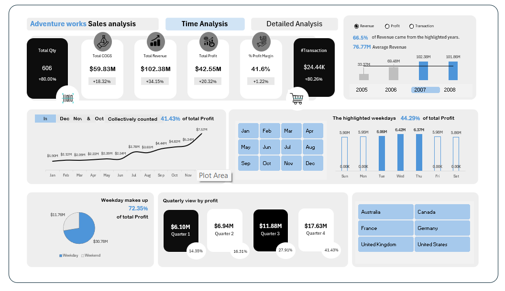
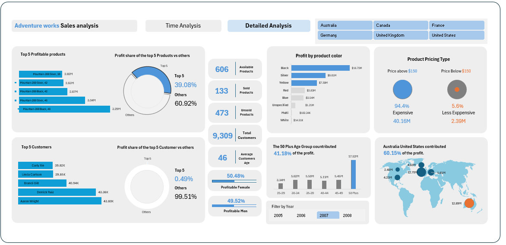

# Adventure Works Sales Analysis (Excel Dashboard Project)

## Project Overview
This project analyzes sales performance, profitability, customer behavior, and product insights using the Adventure Works dataset. The goal is to derive meaningful business insights and present them through structured Excel dashboards to support data-driven decision-making.

---

## Objectives
- Analyze overall sales and profit performance  
- Identify key revenue and profitability drivers  
- Understand customer demographics and purchasing behavior  
- Evaluate product performance and pricing strategy  
- Identify seasonal trends and business patterns  

---

## Dataset
- Source: Adventure Works Dataset  
- Customers: 9,000+  
- Transactions: 24,000+  

Key fields used in the analysis:
- Sales, Profit, Cost  
- Product categories and pricing  
- Customer demographics (age, gender)  
- Order date and geographic regions  

---

## Dashboards

### Time Analysis Dashboard

This dashboard provides a high-level overview of business performance over time.

Key findings:
- Total Revenue: $102.38M  
- Profit Margin: 41.6%  
- 66.5% of revenue is concentrated in specific time periods  
- Q4 contributes 41.43% of total profit  
- Weekdays generate approximately 72% of total profit  

---

### Detailed Analysis Dashboard

This dashboard focuses on deeper insights across products, customers, and geography.

Key findings:
- Top 5 products contribute 39% of total profit  
- 94% of profit comes from products priced above $150  
- Customers aged 50+ contribute 41.18% of total profit  
- United States and Australia contribute 60% of total profit  

---

## Key Business Insights

- The business operates with a high-margin model, maintaining a profit margin of over 40%  
- Revenue is largely driven by premium-priced products rather than high sales volume  
- There is a strong seasonal dependency, with a significant portion of profit generated in Q4  
- Customer contribution is well distributed, indicating low dependency on a small group of customers  
- Revenue is concentrated in developed markets, particularly the United States and Australia  

---

## Business Risks

- Heavy reliance on seasonal performance, especially in Q4  
- Geographic concentration increases exposure to regional market risks  
- Profitability is dependent on a limited set of high-performing products  

---

## Recommendations

- Expand into additional geographic markets to reduce concentration risk  
- Improve sales performance in off-peak periods through targeted campaigns  
- Focus on scaling high-margin products  
- Strengthen customer retention through loyalty programs and engagement strategies  

---

## Tools Used

- Microsoft Excel  
  - Data Cleaning  
  - Pivot Tables  
  - Data Visualization  
  - Dashboard Development  

---

## Skills Demonstrated

- Data Analysis  
- Business Insight Generation  
- Dashboard Design  
- Data Visualization  
- Analytical Thinking  

---

## Conclusion

This project demonstrates the ability to transform raw data into structured insights using Excel. It highlights how data analysis can support business strategy by identifying key trends, risks, and opportunities.
